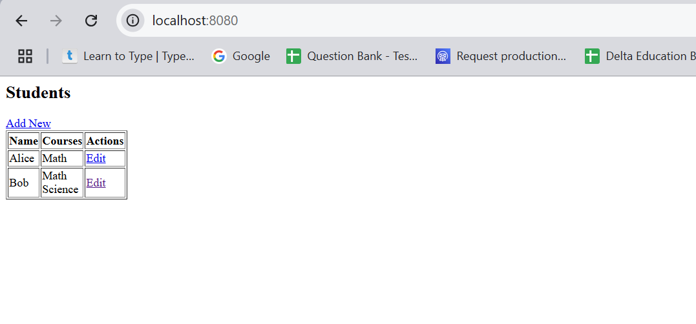
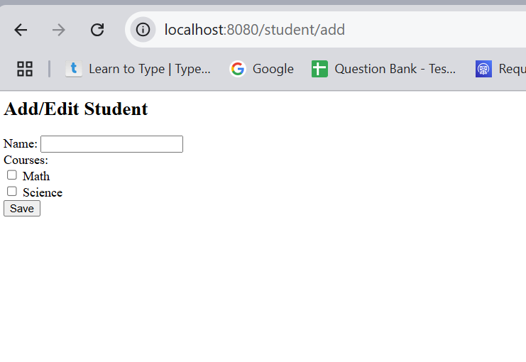
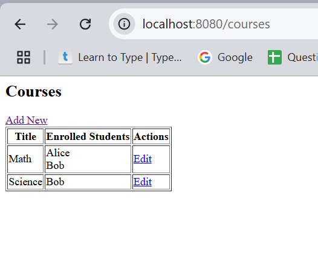
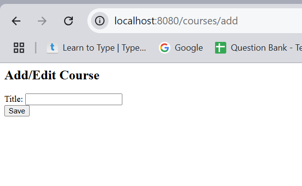
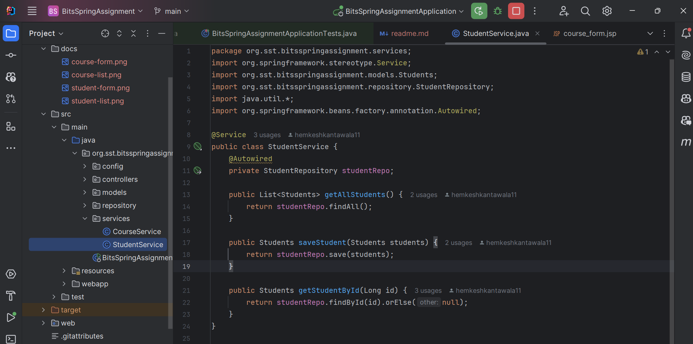
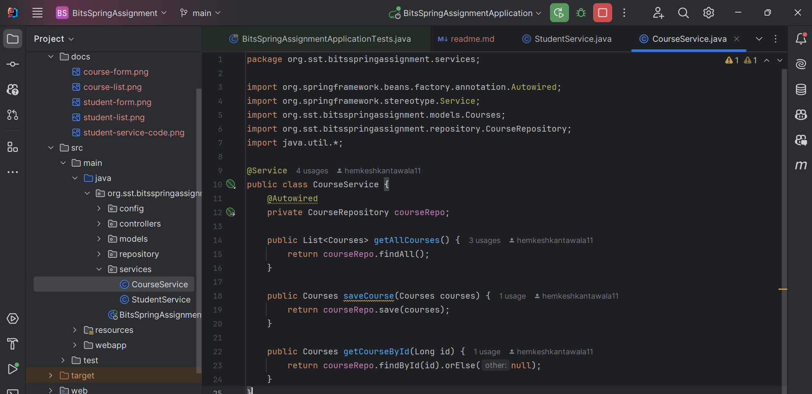
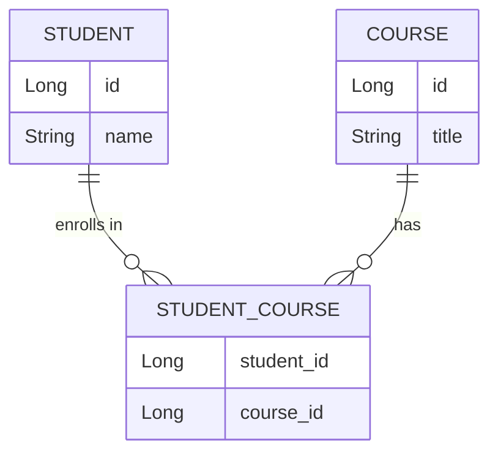

# Github Link : https://github.com/hemkeshkantawala11/bitsAssignment


# Student-Course Management System

A Spring Boot-based web application designed for efficient management of students and their course enrollments. This system supports administrators in handling a many-to-many relationship between students and courses seamlessly.

## Screenshots

### Student Management
[
]()*View of all students along with their enrolled courses*

  
*Form to add or update a student with course selection functionality*

### Course Management
  
*Display of available courses along with enrolled students*

  
*Form to add or modify course information*

### Service Implementation
  
*Business logic implementation for student management*

  
*Business logic implementation for course management*

## Thought Process

### Problem Analysis
- Manage students and their respective course enrollments
- Enable students to register for multiple courses
- Allow courses to accommodate multiple students
- Maintain efficient tracking of these relationships
- Build a user-friendly UI for administration

### Design Decisions

1. **Database Schema**
   - Implemented a many-to-many association between Students and Courses
   - Used a join table for enrollment tracking
   - Adopted a straightforward and clean entity design

2. **Technology Stack**
   - Spring Boot as the backend framework
   - JPA/Hibernate for object-relational mapping
   - JSP for frontend templates
   - Bootstrap for responsive user interface
   - H2 in-memory database for ease of development

3. **System Architecture**
   - Follows MVC architecture
   - Repository layer for database interaction
   - Service layer encapsulates business logic
   - Controllers handle HTTP requests

## ERD Diagram



## Implementation Workflow

1. **Initial Setup**
   - Generated Spring Boot project with necessary dependencies
   - Configured application settings in `application.properties`
   - Defined the overall project structure

2. **Entities**
   - Created `Student` entity
   - Created `Course` entity
   - Defined a many-to-many mapping

3. **Repositories**
   - Developed `StudentRepository`
   - Developed `CourseRepository`
   - Added custom query methods as needed

4. **Services**
   - Built `StudentService` to handle student logic
   - Built `CourseService` for course-related operations
   - Incorporated core business rules

5. **Controllers**
   - Added `StudentController` for student CRUD
   - Added `CourseController` for course CRUD
   - Connected services to frontend via controllers

6. **Frontend (View Layer)**
   - Designed JSP pages for views
   - Styled UI using Bootstrap
   - Integrated validation into forms

7. **Testing**
   - Wrote unit tests for key modules
   - Validated functionality of repositories and services

## Getting Started

### Requirements
- Java 17 or newer
- Maven
- Preferred IDE (e.g., IntelliJ, Eclipse, VS Code)

### Setup Guide

1. **Clone the Project**
   ```bash
   git clone <repository-url>
   cd student-course-management
   ```

2. **Configure Database**
   - Uses H2 by default
   - Configuration available in `application.properties`

3. **Build the Project**
   ```bash
   mvn clean install
   ```

4. **Run the Application**
   ```bash
   mvn spring-boot:run
   ```

5. **Launch in Browser**
   - Navigate to `http://localhost:8080`
   - The homepage displays the student list

## Key Features

### Student Operations
- List all students
- Create new students
- Modify existing students
- Assign students to courses

### Course Operations
- View list of all courses
- Add new course entries
- Update course details
- Display students enrolled in each course

### UI Highlights
- Fully responsive layout
- Bootstrap-based styling
- Validated input forms
- Simple and intuitive navigation

## Running Tests

To execute the test suite:
```bash
mvn test
```

## Project Layout

```
src/
├── main/
│   ├── java/
│   │   └── org/sst/bitsspringassignment/
│   │       ├── controllers/
│   │       ├── models/
│   │       ├── repositories/
│   │       ├── services/
│   │       └── BitsSpringAssignmentApplication.java
│   └── webapp/
│       └── WEB-INF/
│           └── views/
└── test/
    └── java/
        └── org/sst/bitsspringassignment/
            ├── repositories/
            └── services/
```

## Dependencies Used

- Spring Boot Starter Web
- Spring Boot Starter Data JPA
- Spring Boot Starter Test
- H2 In-memory Database
- Bootstrap 5.3.0
- JSTL (JavaServer Pages Standard Tag Library)
- AssertJ for fluent assertions
- Mockito for mocking in tests

## Contributing Guidelines

1. Fork the repository to your account
2. Create a new branch for your changes
3. Commit your changes clearly
4. Push your feature branch
5. Open a Pull Request for review
